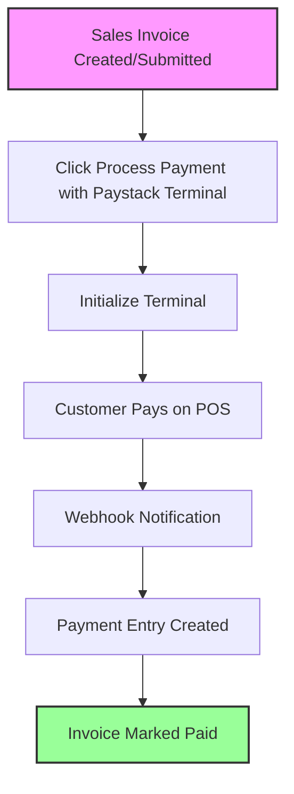

# Paystack Terminal Integration for ERPNext

A seamless integration of Paystack POS Terminal with ERPNext for efficient payment processing.

## Flow Diagram



### Features

- 🔄 Real-time payment processing
- 🏧 Paystack POS Terminal integration
- 📝 Automatic payment entry creation
- 🔍 Payment status tracking
- 🔒 Secure webhook handling
- 📊 Transaction reconciliation
- 🏥 Healthcare module support

## Installation


1. From your site directory:

```
bench get-app https://github.com/yourusername/paystack_terminal.git
bench --site your-site.com install-app paystack_terminal
bench --site your-site.com migrate
```

## Configuration

1. Set up Paystack credentials in ERPNext
2. Configure terminal settings
3. Set webhook URL in Paystack dashboard
4. Enable the integration

## Usage

1. Create Sales Invoice
2. Click "Process Payment with Paystack Terminal"
3. Customer pays on POS terminal
4. System automatically creates payment entry
5. Invoice is marked as paid

## Support the Project

If you find this project useful, consider:

[](https://buymeacoffee.com/ajakaiye33)

give it a star ⭐  👆 

## License

MIT License

## Author

Your Name
- GitHub: [@ajakaiye](https://github.com/ajakaiye33)
- Twitter: [@ajakz](https://twitter.com/ajakzheddy)

## Contributing

Contributions are welcome! Please feel free to submit a Pull Request.

## Acknowledgments

- ERPNext Community
- Paystack Team